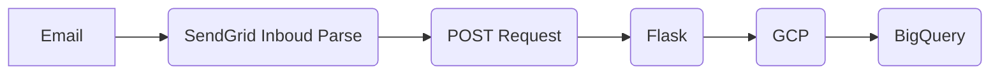

# SendGrid to Google Cloud Storage

## Introduction

This `flask` application container parses email attachments sent as a POST request by `SendGrid Inbound Parse`and saves them to a `Google Storage Bucket`

> This app can be deployed as a part of your pipeline where it triggers another data wrangling, forecasting microservice



## Deploy to Google Cloud

[](https://console.cloud.google.com/cloudshell/editor?shellonly=true&cloudshell_image=gcr.io/cloudrun/button&cloudshell_git_repo=https://github.com/nate-sha/sendgrid-to-gcs.git)

## Run Locally

### Prerequisites

- Python 3.8+
- Docker
- Google Cloud SDK `gcloud`

### Installation

1.  Clone the repository:
    ```
    git clone https://github.com/nate-sha/sendgrid-to-gcs
    ```
2.  Create a virtual environment:
    ```
    python -m venv env
    ```
3.  Activate the virtual environment
    #### Mac OS/Linux
    ```
    source env/bin/activate
    ```
    #### Windows
    ```
    source env/Scripts/activate
    ```
4.  Install Dependencies
    ```
    pip install -r requirements.txt
    ```

### Configuration

To run the application in development mode, you must set some environment variables and run the Flask development server.

##### Set the environment variables

```
export DEBUG=True
```

```
export BUCKET_NAME=your-bucket-name
```

#### Add the `service account` JSON key to the root of the project

## Use Case

> TODO: Complete this section and add a diagram

Your department has multiple contracted agencies that can generate reports such as sales, activity, etc. But the only delivery method offered is by email. They send a daily/weekly report as an attachment via email.

This module takes those emails, parses the attachment, and saves them to `google cloud storage`

This trigger a ML microservice and saves the result into firestore/MongoDB that can be used in your front end
