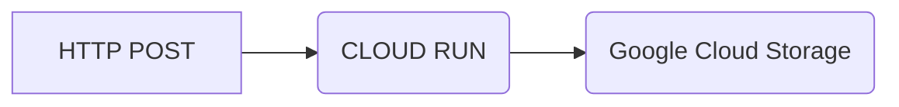

# POST to GCP Storage

A short description of my Django app goes here.



## Deploy to the Cloud

[](https://console.cloud.google.com/cloudshell/editor?shellonly=true&cloudshell_image=gcr.io/cloudrun/button&cloudshell_git_repo=https://github.com/nate-sha/sendgrid-to-gcs.git)

## Cloud Deployemnt

### Create a 'stroge bucket`

### Create a `cloud run service`

#### Select `Continuously deploy new revisions from a source repository`

#### Deploy

## Running Locally

### create and activate the `virtual env`

```
python3 -m venv env
```

### Activate the `enviroment`

#### Linux/MacOS

```
source env/bin/activate
```

#### Windows

```
source env/Scripts/activate
```

### update `pip` and install dependencies

    pip install -r requirements.txt

## Running the application

To run the application in development mode, you must set some environment variables and then run the Django development server.

##### A. Set the environment variables

`export DJANGO_DEBUG=True`
`export DJANGO_SECRET_KEY=your-secret-key`

### Run main.py

```
python3 main.py
```
